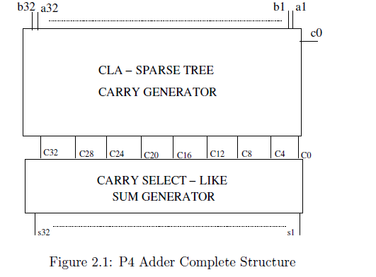
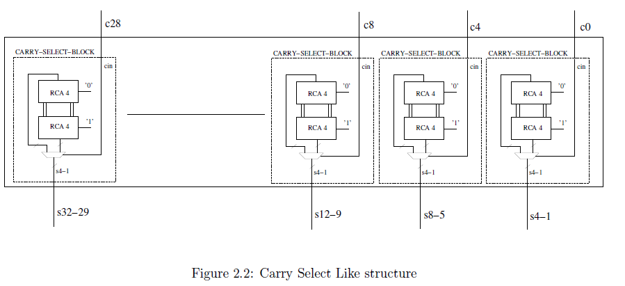
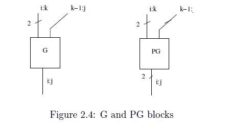
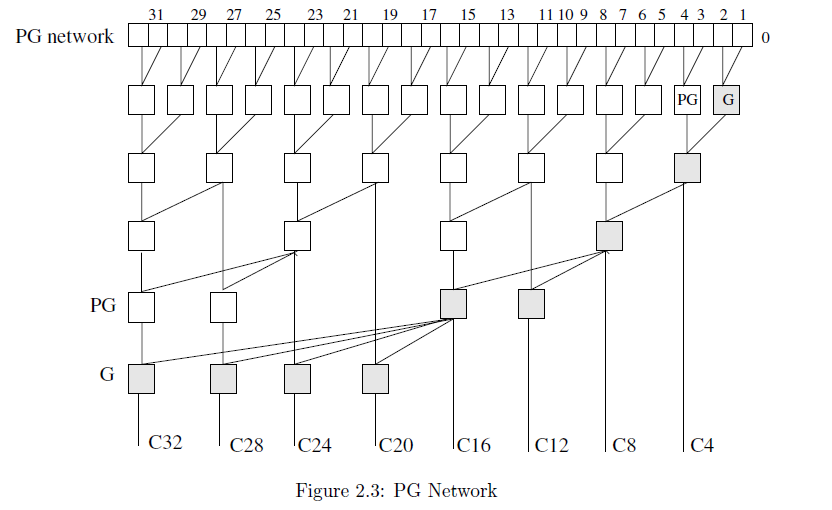

# Intel P4 Carry lookahead sparse tree adder
This project aims to describe the P4 adder by means of VHDL.
## The sparse tree
### Description
The core of this project is the sparse tree, which increases the performance wrt the standard carry propagation used in our beloved Ripple Carry Adder (RCA).
To simplify the notation, we make use of PG and G blocks, which are depicted in the picture below.
Nevertheless, this adder doesn't get rid of the RCAs, but instead uses smaller versions of them. Thus, each RCA requires a carry input which is provided by the sparse tree.

### To better understand...





### The algorithm
The critical part of this tree, is finding a good algorithm that is enough general to take into account:
<ul>

 <li> the width between to carries </li>
 <li> the parallelism on which to perform the addition or subtraction </li>
</ul>

#### 1. Generate the first level of PG blocks
```VHDL
--generate the first layer of PG blocks
PG_NETWORK : for i in 0 to NBIT-1 generate
carry_in_PG_G: if (i = 0) generate
    PG_0 : pgb port map(ai => A(i), bi => B(i), p => p_pgb00_G00, g => g_pgb00_G00);
    G_0  : G port map(Pik  => p_pgb00_G00,
                    Gik  => g_pgb00_G00,
                    Gdkj => Cin,
                    Gij  => gi_matrix(0)(i));
end generate carry_in_pg_g;
std_PG: if (i >= 1) generate
    PG_i : pgb port map(ai => A(i), bi => B(i), p => pi_matrix(0)(i), g => gi_matrix(0)(i));
end generate std_PG;
end generate;

```
We create the first layer of PG blocks and only in the first block (the rightmost in the picture) we use also a G block to take into account subtraction.
## WAIT 
Before going on, the following relations are found
The number of PG blocks in a given carry column (i.e. the column where we want to have a final G block) is:  

$
    PG = floor(log2(column))
$  

**Example**: if I'm on column C12 the total amount of PG blocks should be floor(log2(12)) = floor(3.58) = 3

Another important relation is, each PG block after the first layer is connected to itself and to the column numbered as follows:  

$
    right\_connection = current\_column - 2^{depth}
$  

**Example** : if I'm on column C12 the first PG (i.e. at depth = 0) takes the input from the couple (12,11), then the second PG block takes the input from the couple (12, 10).

The last important relation is that, each G block is connected to its own column and to the lower G block placed on a column whose numbering is a power of 2.

**Example** : If I'm on column C12, the G block is therefore connected to block $G_8$

#### 2. The pre-carry tree
```VHDL
FIRST_SUBGROUPING : for depth in 1 to log2(NBIT_PER_BLOCK) generate
    FIRST_MERGE : for j in 0 to NBIT_PER_BLOCK/(2**depth) -2 generate
      -- then there's space for PG block
      INITIAL_PG_i : PG port map(Pik  => pi_matrix(depth-1)(NBIT_PER_BLOCK-1 - j*(2**depth)),
                                 Gik  => gi_matrix(depth-1)(NBIT_PER_BLOCK-1 - j*(2**depth)),
                                 Pdkj => pi_matrix(depth-1)(NBIT_PER_BLOCK-1 -j*(2**depth) - 2**(depth-1)),
                                 Gdkj => gi_matrix(depth-1)(NBIT_PER_BLOCK-1 -j*(2**depth) - 2**(depth-1)),
                                 Pij => pi_matrix(depth)(NBIT_PER_BLOCK-1 -j*(2**depth)),
                                 Gij  => gi_matrix(depth)(NBIT_PER_BLOCK-1 -j*(2**depth)));
    end generate;
    INITIAL_G_i : G port map(Pik  => pi_matrix(depth-1)(2**depth -1),
                             Gik  => gi_matrix(depth-1)(2**depth -1),
                             Gdkj => gi_matrix(depth-1)(2**(depth-1) - 1),
                             Gij  => gi_matrix(depth)(2**depth -1));
  end generate;
```
The key point here is to generate the carry C_{NBIT_PER_BLOCK} using a merge tree, we do so by **Divide&Impera** method. The method consists in creating pairs and then merging them together, then creating larger pairs and merging them together, up to the final carry.  

This is done by using a first for generate loop that cycles as many times as the number of successive pairings that we can find. At the end of each loop FIRST_MERGE, we place a G block, because at each level we need to generate a carry from the previous PG blocks.  

Each PG block uses NBIT_PER_BLOCK-1 to retrieve the current column, uses j*(2**depth) to get the leftmost member of a pair and then uses the depth to connect as was state in relations above.

Then, the iteration continues...  

**Example**: If our goal is to generate $C_4$ then, we have log2(4) cycles. The solution in fact, starts bottom up with smaller problems (i.e. couples such as [1,2],[3,4]) up to the final iteration where $C_4$ can be computed merging the previous partial carries that have ben generated so far.
<ol>
<li> [1,2] and [3,4] </li>
<li> Place a G(1:2) </li>
<li> The for loop can't iterate, then place another G in column 4, that is G(4:1) </li>
</ol>

#### 3. The rest of the tree
Now that we have tackled, the problem of generating the pre-carry tree, we need to generate the rest of the tree. This is done by more or less the same algorithm.

```VHDL
TREE : for i in 2 to NBIT/NBIT_PER_BLOCK generate
    SUBGROUPING : for depth in 1 to log2(NBIT_PER_BLOCK) generate
      MERGE : for j in 0 to NBIT_PER_BLOCK/(2**depth) -1 generate
        PG_i : PG port map(Pik  => pi_matrix(depth-1)(i*I_MULTIPLIER-1 - j*(2**depth)),
                           Gik  => gi_matrix(depth-1)(i*I_MULTIPLIER-1 - j*(2**depth)),
                           Pdkj => pi_matrix(depth-1)(i*I_MULTIPLIER-1 -j*(2**depth) -2**(depth-1)),
                           Gdkj => gi_matrix(depth-1)(i*I_MULTIPLIER-1 -j*(2**depth) -2**(depth-1)),
                           Pij  => pi_matrix(depth)(i*I_MULTIPLIER -j*(2**depth) -1),
                           Gij  => gi_matrix(depth)(i*I_MULTIPLIER -j*(2**depth) -1));
      end generate;
    end generate;

    -- if i add 1 PG is the number greater than log2(column_i) -1?
    REMAINING_PG : for depth in log2(NBIT_PER_BLOCK) to log2(i*I_MULTIPLIER)-2 generate
      REMAINING_PG_i : PG port map(Pik  => pi_matrix(depth)(i*I_MULTIPLIER-1),
                                   Gik  => gi_matrix(depth)(i*I_MULTIPLIER-1),
                                   Pdkj => pi_matrix(depth)(i*I_MULTIPLIER-1-2**(depth)),
                                   Gdkj => gi_matrix(depth)(i*I_MULTIPLIER-1-2**(depth)),
                                   Pij  => pi_matrix(depth+1)(i*I_MULTIPLIER-1),
                                   Gij  => gi_matrix(depth+1)(i*I_MULTIPLIER-1));

    end generate;
    -- add the final G block on multiple of NBIT_PER_BLOCK
    FINAL_G_i : G port map (Pik  => pi_matrix(log2(i*I_MULTIPLIER)-1)(i*I_MULTIPLIER-1),
                            Gik  => gi_matrix(log2(i*I_MULTIPLIER)-1)(i*I_MULTIPLIER-1),
                            Gdkj => gi_matrix(log2(2**log2(i*I_MULTIPLIER-1)))(2**log2(i*I_MULTIPLIER-1)-1),
                            Gij  => gi_matrix(log2(i*I_MULTIPLIER))(i*I_MULTIPLIER-1));

  end generate;
```

In this section of the algorithm, we divide the remaining amount of bits in block each of size NBIT_PER_BLOCK and we perform operations on each block at a time. Then, for each block as in the previous section we use the Divide&Impera approach starting from couples of bits we go up until we merge the carry. Then, in the REMAINING_PG section we verify the need for extra PG blocks using the relations pointed out in the above sections. Finally, we place the G block using the relations.

#### 4. Map the carry out
```VHDL
  COUT_MAPPING : for i in 1 to (NBIT/NBIT_PER_BLOCK) generate
    Co(i-1) <= gi_matrix(log2(i*NBIT_PER_BLOCK))(i*NBIT_PER_BLOCK-1);
  end generate;
```
Finally, we map the carry out to the gi_matrix of signals where all the G blocks are connected. Using the previous relations, we know that each G block outputs its carry at depth equal to the log2 of the current column.